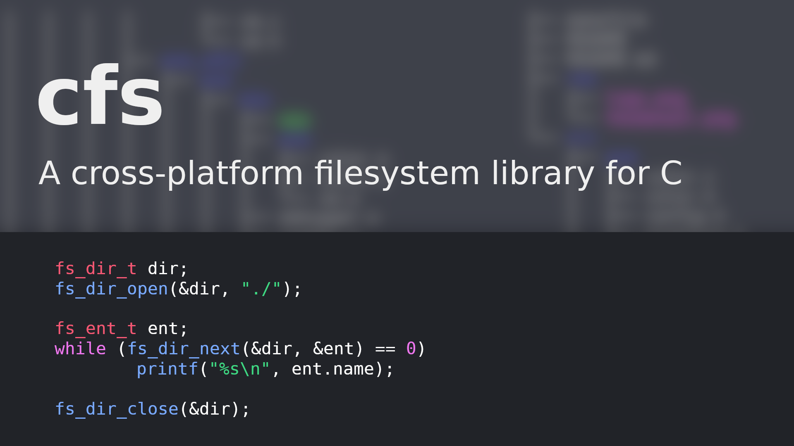
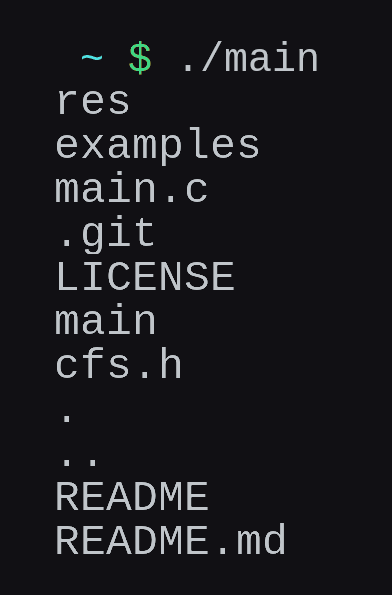

<h1 align="center">cfs</h1>
<p align="center">
	<a href="./LICENSE">
		
	</a>
	<a href="https://github.com/LordOfTrident/cfs/issues">
		
	</a>
	<a href="https://github.com/LordOfTrident/cfs/pulls">
		
	</a>
	
	<br><br><br>
</p>

A simple single-header [STB-style](https://github.com/nothings/stb) cross-platform C filesystem library.

## Table of contents
* [Simple example](#simple-example)
* [Quickstart](#quickstart)
* [Bugs](#bugs)

## Simple example
```c
#include <stdio.h> /* printf */

#define CFS_IMPLEMENTATION
#include "cfs.h"

int main(void) {
	fs_dir_t dir;
	fs_dir_open(&dir, "./");

	fs_ent_t ent;
	while (fs_dir_next(&dir, &ent) == 0)
		printf("%s\n", ent.name);

	fs_dir_close(&dir);
	return 0;
}
```
Output



## Quickstart
Just copy [`cfs.h`](./cfs.h) into your project or submodule this repository and include the header.
[See the examples](./examples) to see how to use the library.

To compile and run the examples, run
```sh
$ cc ./examples/ls.c -o ls
$ cc ./examples/copy.c -o copy
$ cc ./examples/link.c -o link
$ cc ./examples/join.c -o join
$ cc ./examples/foreach.c -o foreach
$ ./ls
$ ./copy
$ ./link
$ ./join
$ ./foreach
```

## Bugs
If you find any bugs, please create an issue and report them.
